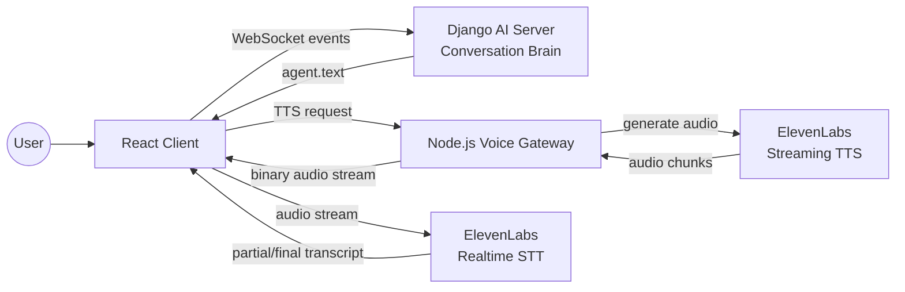
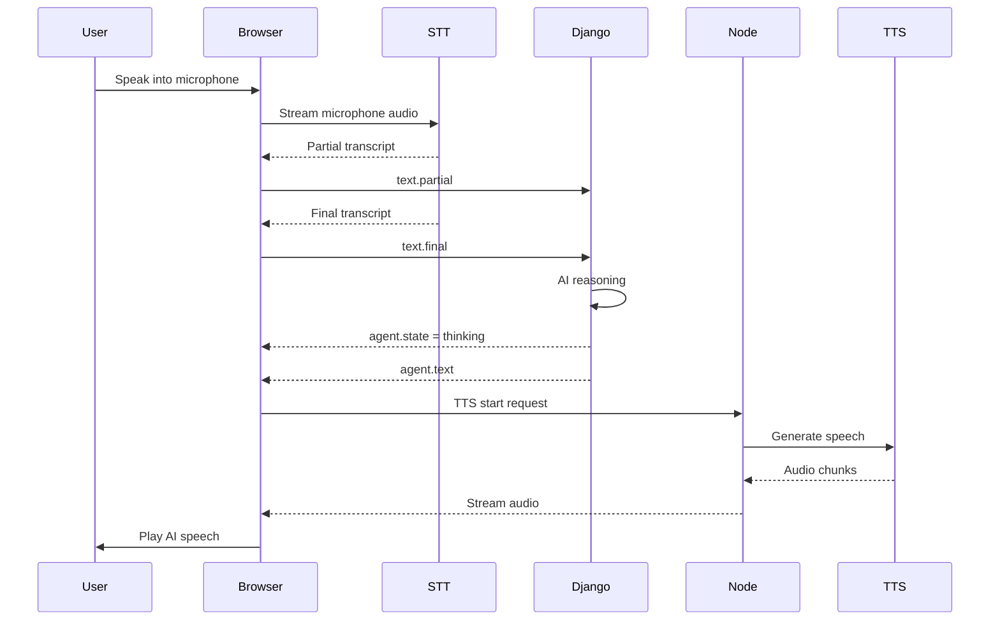

# Real-Time AI Voice Call (React Client)

This project implements a real-time AI voice call system that allows users to have a **natural phone-style conversation with an AI agent**.

The client streams microphone audio to a speech-to-text service, sends transcripts to an AI agent, and receives streaming text-to-speech audio responses — all with **low latency and interruptible turn-taking**.

The goal is to replicate a **human-like conversation flow** where users can interrupt the AI while it speaks and immediately take control of the conversation.

---

## System Overview

The voice system is part of a larger AI chat platform that supports:

- **text chat** (HTTP)
- **audio messages** (HTTP)
- **real-time voice calls** (WebSocket streaming)

The real-time voice stack combines:

- React client
- Django AI backend
- Node.js real-time audio gateway
- ElevenLabs real-time STT/TTS

---

## Real-Time Voice Architecture

The system separates responsibilities between two backend services.



### Responsibilities

**React Client**

- microphone capture
- STT streaming
- AI event protocol
- TTS streaming playback
- conversation turn-taking

**Django (Core AI Backend)**

- WebSocket call protocol
- AI agent logic
- conversation state
- dialogue generation
- message orchestration

Django acts as the brain of the conversation.

**Node.js (Realtime Voice Gateway)**

- authentication token proxy for STT
- streaming TTS audio
- audio WebSocket gateway
- integration with ElevenLabs realtime APIs

The Node service isolates real-time media processing from the main backend.

---

## Voice Conversation Pipeline

The voice interaction pipeline works as follows:

```
User Speech
   ↓
Realtime STT (ElevenLabs Scribe)
   ↓
Partial + Final Transcripts
   ↓
WebSocket → Django Agent
   ↓
Agent Reasoning
   ↓
Agent Text Response
   ↓
Node TTS Gateway
   ↓
Streaming Audio Playback
```

This pipeline allows low latency responses and continuous conversation flow.

---

## Conversation Sequence Example



---

## Turn-Taking & Barge-In

A key challenge in voice interfaces is conversation control.

This system implements barge-in support, allowing users to interrupt the AI mid-speech.

When user speech is detected during AI playback:

1. TTS generation stops
2. Audio playback resets
3. STT resumes
4. User speech becomes the active input

Example logic from the call orchestrator:

```ts
if (agentState === "speaking") {
  tts.stop();
  audio.reset();
  stt.resume();
}
```

This produces **a natural conversational dynamic** similar to human phone calls.

---

## Client Architecture

The real-time call is orchestrated through specialized React hooks.

### `useCallRealtime`

The main hook that manages the call lifecycle.

Responsibilities:

- WebSocket connection lifecycle
- STT start / pause / resume
- TTS playback coordination
- AI agent state tracking
- call timer
- teardown logic

Agent states:

```
idle
thinking
speaking
```

These states control whether STT should listen or pause.

---

### `useRealtimeSTT`

Handles **speech recognition streaming**.

Features:

- microphone streaming
- partial transcript events
- final transcript commits
- pause/resume gating
- session lifecycle management

Transcript types:

```
PARTIAL_TRANSCRIPT
COMMITTED_TRANSCRIPT
```

Partial transcripts allow the system to react before the user finishes speaking.

---

### `useTTSSocket`

Handles **streaming text-to-speech audio** from the Node.js gateway.

Features:

- WebSocket streaming
- binary PCM audio chunks
- playback signaling
- graceful stop handling

Audio data is streamed as ArrayBuffer PCM frames and pushed into the audio player buffer.

---

### `useAudioPlayer`

Handles low-latency audio playback.

Responsibilities:

- audio chunk buffering
- streaming playback
- reset and stop control

---

## Event Protocol

The real-time call uses a lightweight event protocol.

### Client → Server

```
text.partial   streaming transcript
text.final     confirmed transcript
call.end       user ends the call
```

### Server → Client

```
agent.state    idle | thinking | speaking
agent.text     final AI response text
error          error message
```

This protocol separates conversation state from audio streaming.

---

## Microphone Diagnostics

The client performs microphone health checks before starting STT.

Possible block reasons:

```
mic-unavailable
permission-denied
device-muted
```

This prevents silent failures when browsers block audio input.

---

## Call Lifecycle

1. WebSocket call connection established
2. Microphone permission requested
3. STT session starts
4. User begins speaking
5. AI agent processes transcripts
6. Streaming TTS responses are played
7. User can interrupt AI at any time
8. Call ends via teardown or user action

Shutdown sequence:

```
STT.stop()
TTS.stop()
audio.reset()
CALL_END event
```

---

## Technologies Used

Frontend:

- React
- TypeScript
- WebSocket streaming
- Web Audio API

Backend:

- Django (AI orchestration)
- Node.js (voice gateway)

AI & Voice:

- ElevenLabs realtime Scribe (STT)
- ElevenLabs streaming TTS

---

## Why This Architecture?

Real-time voice systems introduce challenges that do not exist in text chat:

- audio streaming
- concurrency control
- turn-taking
- latency management
- interrupt handling

Separating the **AI brain (Django)** from the **voice gateway (Node.js)** allows the system to scale and evolve independently.

---

## Future Improvements

Possible extensions:

- voice activity detection (VAD)
- WebRTC audio transport
- adaptive latency buffering
- multi-agent voice conversations
- conversation memory
- mobile browser optimization

---

## Project Goal

This project explores how to build a **production-style AI voice conversation stack** in the browser, combining modern speech models with real-time web technologies.

---
