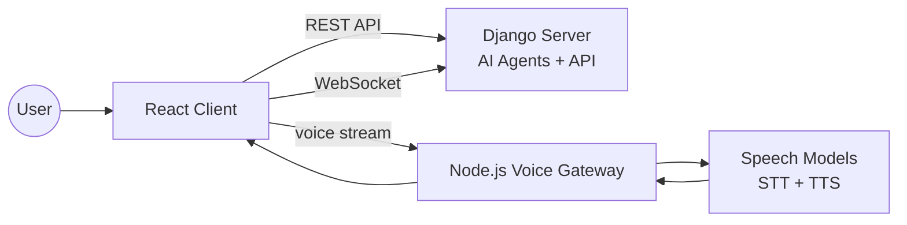
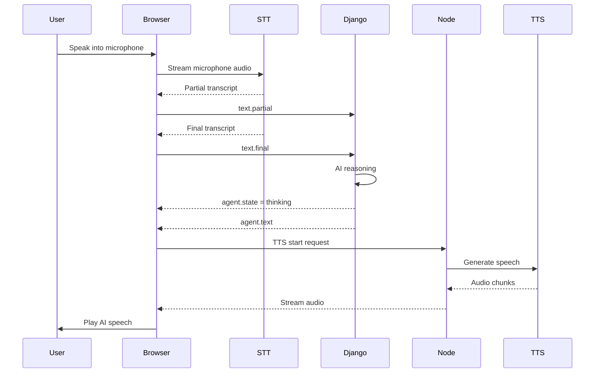

# Talk With Videos — AI Hosts for Learning

This project explores a new way of learning from online videos.

Instead of only watching a video, users can **talk with an AI Host that understands the content of the video**.  
The Host can answer questions, discuss topics, and guide the conversation based on the video material.

This turns passive video watching into an **interactive learning experience**.

---

## The Idea

Platforms like YouTube contain enormous amounts of knowledge, but learning from videos is usually **one-directional**.

This project adds a conversational layer:

```
Watch video → Ask questions → Discuss ideas → Practice speaking
```

Each video can have an **AI Host** that understands the content and interacts with the viewer.

Examples of possible learning scenarios:

- language learning
- IELTS speaking practice
- programming tutorials
- math explanations
- general educational content

Instead of only watching, users can **ask questions and explore topics through conversation**.

---

## AI Hosts

Each Host is designed like a character.

Hosts can have:

- a unique voice
- a defined personality
- a role or background story
- knowledge about specific videos or topics

The concept is inspired by the **Hosts from Westworld**, where each character has its own identity.

Example Host:

```
Host: IELTS Speaking Examiner
Voice: British Male
Role: IELTS examiner
Knowledge: IELTS practice videos and speaking topics
Personality: formal and structured
```

---

## Interaction Modes

Users can communicate with Hosts in several ways.

### Text Chat

Standard conversation with the Host.

```
User message → Django API → AI agent → response
```

### Audio Messages

Users can send recorded voice messages and receive spoken replies.

```
Voice message → Speech-to-text → AI agent → Text-to-speech
```

### Real-Time Voice Call

Users can have a live conversation with the Host.

Features:

- real-time speech recognition
- streaming AI responses
- streaming speech synthesis
- interruptible AI speech

This makes the interaction feel like **talking to a real person**.

---

## System Architecture

The system separates conversation logic from real-time voice processing.



### React Client

Provides the user interface and voice interaction:

- video + chat interface
- audio recording
- real-time call
- streaming audio playback

### Django (Core AI Backend)

Main backend responsible for:

- AI conversation logic
- Hosts and video knowledge
- chat APIs
- WebSocket call protocol

### Node.js (Realtime Voice Gateway)

- authentication token proxy for STT
- streaming TTS audio
- audio WebSocket gateway
- integration with ElevenLabs realtime APIs

The Node service isolates real-time media processing from the main backend.

---

## Voice Conversation Pipeline

The voice interaction pipeline works as follows:

```
User speech
  ↓
Speech-to-text
  ↓
AI Host reasoning
  ↓
Text response
  ↓
Text-to-speech
  ↓
Audio playback
```

Users can also interrupt the AI while it is speaking, creating a natural conversational experience.

---

## Conversation Example



---

## Technologies Used

Frontend:

- React.js
- TypeScript
- Web Audio API
- WebSocket streaming

Backend:

- Django (AI agents + APIs)
- Node.js (real-time voice gateway)

Speech:

- ElevenLabs realtime Scribe (STT)
- ElevenLabs streaming TTS

---

## Project Goal

The goal of this project is to transform video learning from a passive experience into an **interactive conversation**.

Instead of only watching a video, users can **talk with it**.

---
